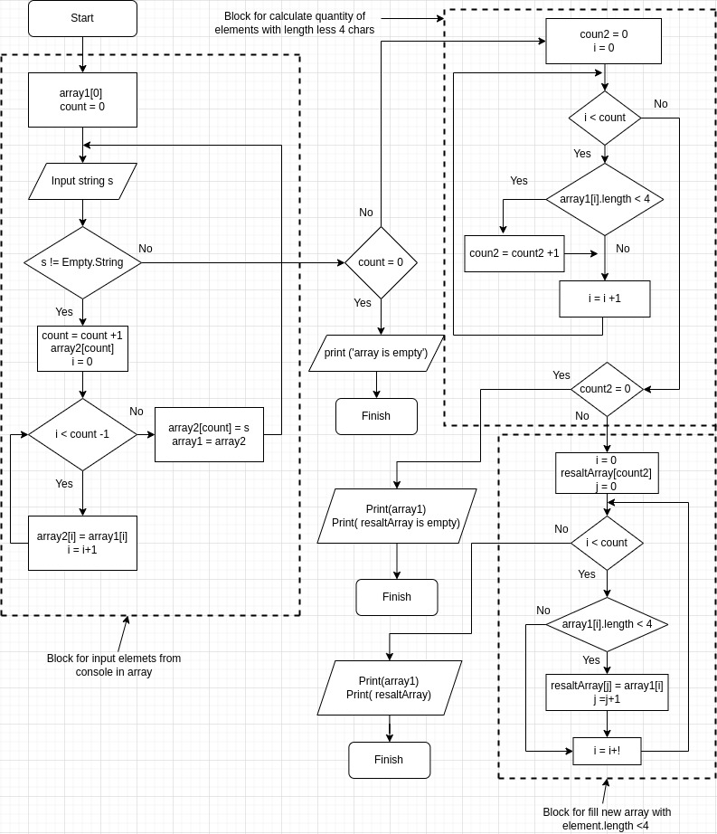

# Итоговая проверочная работа
**Содержание**  
[Задание](##1-Задание)  
[Примеры](##2-Примеры)  
[Требования](##3-Требования)  
[Описание](##4-Описание)  
[Блок-схема](##5-Блок-схема)  

## 1. Задание
**Задача:** Написать программу, которая из имеющегося массива строк формирует массив из строк, длинна которых меньше либо равна 3 символа. Первоначальный массив можно ввести и клавиатуры, либо задать на старте выполнения алгоритма. при решении не рекомендуется пользоваться коллекциями, лучше обойтись исключительно массивами.  
**Требования**  
1. Создать репозиторий на GitHub.
2. Нарисовать блок-схему, алгоритма (можно обойтись блок-схемой основной содержательной части, если вы выделяете ее в отдельный метод)  
3. Снабдить репозиторий оформленными тестовым описанием решения(файл README.md).  
4. Написать программу, решающая поставленную задачу.
5. Использовать контроль версии в работе над этим небольшим проектом (не должно быть так, что все залито одним коммитом, как минимум этапы 2, 3, и 4 должны быть расположены в разных коммитах)  

## 2. Примеры
["hello", "2", "world", ";-)"] -> ["2", ";-)"]  
["1234", "1567", "-2", "computer science"] -> ["-2"]  
["Russia", "Denmark", "Kazan"] -> []

## 3. Требования  
Программа написана на языке С# с использованием  
 `.NET SDK:`  
` Version:   7.0.102`  
 `Commit:    4bbdd14480"`

`Runtime Environment:`  
 `OS Name:     arch`  
 `OS Version: `   
 `OS Platform: Linux`  
` RID:         arch-x64  `

`Host:`  
  `Version:      7.0.2`  
  `Architecture: x64`  
  `Commit:       d037e070eb`  

`.NET SDKs installed:`  
  `7.0.102`  

`.NET runtimes installed:`  
  `Microsoft.NETCore.App 6.0.13`  
  `Microsoft.NETCore.App 7.0.2 `  

`Environment variables:`  
  `DOTNET_ROOT`   

Learn more:
  https://aka.ms/dotnet/info

Download .NET:
  https://aka.ms/dotnet/download  

## 4. Описание  

Программа работает в консоли. После запуска попросит ввести массив элементов строк.
Ввод осуществляется с клавиатуры, чтобы закончить ввод элемента нажмите "Enter". Если вы ввели все элементы, чтобы закончить ввод, необходимо строку оставить пустой и нажать "Enter". После этого программа определит элементы массива, длинна которых менее 4 символов. Выделит эти элементы и создаст новый массив в котором будут содержаться только элементы, длинна которых менее 4 символов. Входные данные строки. Выходные: массив строк, переработанный массив строк.  

## 5. Блок-схема  

